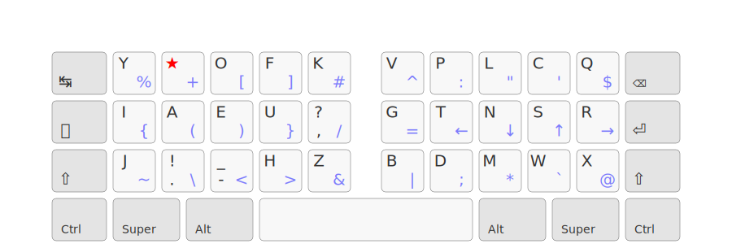
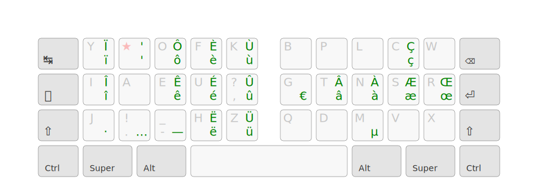
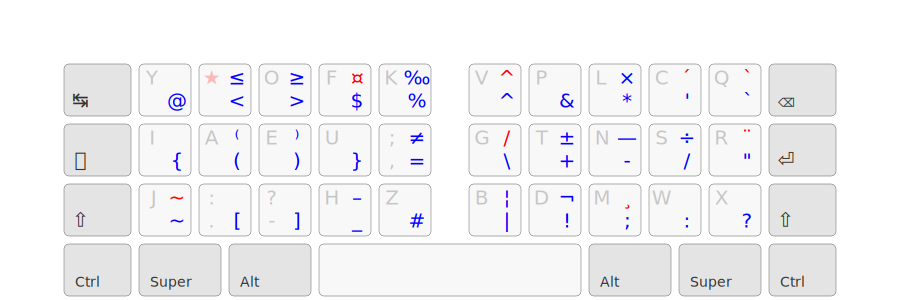

# Erglace

## Ressources utilisées

- [Keyboard Layouts Doc](https://bit.ly/keyboard-layouts-doc), ressource théorique très complète
- La [page de statistiques](https://lysquid.github.io/Erglace/stats) d'Ergo-L
- [Layout playground](https://o-x-e-y.github.io/layouts/playground/), pour des statistiques complémentaires (LSB, BadRedirects) et du prototypage rapide
- Les [statistiques de fréquence](corpus/) de Ergo-L pour le français et l'anglais
- [Heatmap d'effort](https://colemakmods.github.io/mod-dh/model.html) des touches du clavier, développée pour Colmak-DH
- Les retours sur le [discord d'Ergo-L](https://discord.gg/RH34GjQEgC)

## Layout

## Notes de conceptions

- Le point de départ était de faire une disposition avec moins de redirections que Ergol-L. Nous nous sommes vite rendu compte qu'il fallait pour cela isoler les voyelles de consonnes. Les lettres de la home row sont les lettres les plus utilisées du français et de l'anglais.

- Les voyelles sont à gauche car ErgEAU tire profit des touches disponibles tout à droite pour rajouter des consonnes rares. Par ailleurs, c'est aussi le choix de Bépo et Optimot, ce qui permet des transitions plus faciles.

- Pour l'ordre des consonnes de la home row, nous avons cherché à maximiser les roulements, tout en s'assurant d'une bonne répartition de la charge. `t` est un bon candidat pour l'index, puisqu'il se combine assez peu avec d'autres consonnes comparé aux autres, or l'index à 6 lettres. Les autres ordres testés avaient une répartition de charge moins bonne et/ou un SFB plus haut. Cet ordre  a toutefois le défaut de privilégier les outrolls, et n'est pas celui qui minimise les redirects (voir l'ordre de Nerps).

- Le raisonnement est similaire pour l'ordre des voyelles. `u` est de loin la lettre qui se combine le moins avec les consonnes et les signes de ponctuation, il a donc sa place sur l'index, même si c'est une lettre peu courante en anglais. Le roulement `eau`, courant en français, a donné l'ordre de voyelles de ErgEAU.

- Toutefois, `e` est une lettre particulière puisque c'est la plus utilisée et elle se combine avec la quasi-totalité des autres lettres, à l'exception de `o` et des lettres accentuées. N'ayant pas de touches dédiées aux accents comme ErgEAU, j'ai dû me résoudre à mettre `o` au-dessus de `e`. La charge devenant trop grande pour l'annulaire, je l'ai mis sur l'index comme en Ergo-L et Optimot. `a` est resté sur l'annulaire car il a une charge plus importante que `i`. Les enchaînements de cette disposition restent bons, à l'exception du bad redirect assez ironique `aie`, équivalent de `sad` en qwerty.

- J'ai essayé de laisser `e` sur l'annulaire, d'abord en mettant la touche morte au-dessus, ce qui faisait une charge beaucoup trop importante pour l'annulaire, ou en mettant une lettre rare, tel que `k` ou `z`, mais le SFB engendré était de loin le plus important du layout, et je trouvais dommage de mettre une des lettres les plus rares sur un bon emplacement.

- Nous avons d'abord cherché à conserver le roulement `th`, digramme le plus commun. Mais nous nous sommes rendu compte que `h` allait aussi très bien du côté des voyelles avec lesquelles il fait de nombreux roulements, même si ce sont des outrolls. Avoir `h` sous `u` permet aussi de charger plus l'index en anglais.

- Les autres consonnes du côté de voyelles ont été choisies pour minimiser le SFB. `j` est en bas pour simplifier l'écriture de `je`, et `f` en haut pour taper `of`. `y` en haut permet quant à lui un roulement confortable pour écrire `you`. Une attention particulière a été portée sur le LSB, qui reste malgré tout élevé à cause des digrammes `e,`, `ez` et `ek`, ce qui est assez inévitable compte tenu du placement de `e`.

- La charge de l'annulaire est alors plus importante que celle de l'index en français. J'ai essayé de mettre la touche morte sur l'index comme en ErgEAU, mais comme `e`, `a` se lit à presque toutes les autres lettres. On retrouve donc les mêmes problèmes qu'avec `e`, mais cette fois avec une charge trop faible sur l'annulaire. Par ailleurs, le touche morte sur l'index réduisait encore la charge de ce doigt en anglais.

- Le placement des consonnes restantes à droite à fait l'objet de beaucoup de variations. `dmlcp` sont celles qui ont le moins bougé, étant les consonnes plus fréquentes après celle de la home row, elles occupent les meilleurs emplacements sur les colonnes où elles font le moins de SFB. Le placement de `c` et `p` en haut permet de garantir de bons enchaînements avec `l`.

- Nous avons considéré d'inverser `d` et `p` pour le digramme `ld`. Mais `ld` est moins courant que `pl`, et `d` serait plus difficale à atteindre en haut, alors qu'il est deux fois plus courant que `p`.

- Le cas de `g` est particulier du fait de l'importance des  digrammes `ng` et `gr`. Le placer en bas l'annulaire rend ces digrammes inconfortables sur un clavier split. Pour ne pas avoir un trop gros LSB avec le digramme `ng`, la seule position convenable est donc à gauche de `t`.

- Les consonnes restantes, `vbwq` peuvent être interchangées facilement, et ont fait l'objet d'une mise à jour de la dispositon. Le `v` était initialement placé sur l'annulaire en bas, mais l’enchaînement `vr` était alors très inconfortable. Le `w` a pris cette place, au détriment de la compatibilité Vim puisque `cw` devient un SFB important. Heureusement, `ce` fait le même chose que `cw` sur Vim. `q` se retrouve sur l'auriculaire car c'est le moins utilisé.

- `v` et `b` sont alors sur l'index et peuvent être facilement inversés. Le choix de `b` en bas à été fait pour éviter l'enchaînement `mb` qui est très compliqué avec `b` en haut. Cela se fait au détriment de l'enchaînement `bl` qui est deux fois plus courant, mais tout de même plus acceptable. Un avantage à avoir `v` en haut est de pouvoir enchaîner Ctrl+C et Ctrl+V.

- `q` et `x` sur la colonne de l'auriculaire peuvent aussi être intervertis. Mais `q` étant beaucoup plus courant, il a la position la plus confortable, en haut. Un défaut est l'enchaînement `sq` qui n'est alors pas très confortable.

- Les accents ont ensuite été répartis sur la couche correspondante, de préférence proches des lettres correspondantes, dans la limite de la place disponible du côté des voyelles. `ê` est sur e, car il y a souvent un autre `e` dans le même mot comme dans `même` et `être`.

- `a` étant sous la touche morte, ses variantes accentuées ne peuvent pas être sur cette colonne sous peine d'un SFB important. `à` et `â` ont donc été placés à droite sur les lettres avec lesquelles il fait le plus petit SFB. `œ` a aussi été placé à droite par manque de place, ce qui lui donne une place sur la home row.

- `é` est de loin l'accent le plus important, étant la 15ème lettre la plus utilisée en français. Le placer sous `e` rendrait le digramme `ée` lent et surchargerait encore plus le majeur. J'ai essayé de le placer sous `r`, colonne sur laquelle le SFB est minimal, mais le SKU engendré sur l'annulaire était considérable, et se ressentait beaucoup dans des mots comme 'préféré'. J'ai finalement opté pour le mettre derrière `u`, ce qui lui donne une place confortable sur la home row, et qui s’enchaîne bien avec `e`. Cela permet aussi de mieux charger l'index en français. La contre-parti est les digrammes `é,` et `éf`, ainsi qu'un décalage nécessaire des variantes accentuées de `u`.

- `_` a une place sur la home de la couche 1dk pour pouvoir écrire facilement des noms de fichiers et variables où les mots sont espacés d'underscores.

- `-` est derrière `e` en shift pour minimiser le SFB. N'importe quel autre caractère créé un SFB important avec la colonne `oe`. `,` a une meilleure position que `.` car elle est beaucoup plus courante.

- J'aurais aimé avoir `'` en accès direct puisque c'est un caractère courant en français, anglais et programmation, mais il se lit avec toutes les lettres. Je suis resté sur la solution plutôt élégante de Ergo-L, d'avoir `'` derrière la touche morte + espace, qui garantit un SFB minimum.

- Historiquement, Erglace avait sa propre couche de symbole, héritée de ma couche personelle, toujours disponible sur mon [firmware QMK](https://github.com/Lysquid/qmk_keymap). Mais Erglace étant développé au sein de la communauté Ergo-L, il est apparu plus pertinent de reprendre celle d'Ergo-L. Cela permet de simplifier la maintenance et de rendre plus clair la différence entre Ergo-L et Erglace.

- Dans cette version précédente, `?`, `!` et `_` étaient respectivement derrière `,`, `.` et `-` en shift. Nous avons longtemps débattu sur ce sujet, la conclusion étant que cela est plutôt une affaire de goût personnel. La solution la plus simple a donc été de se caler sur les conventions d'Ergo-L, ce qui simplifie la compatibilité avec la couche de symboles.

## Statistiques utiles

Quelques statistiques non exhaustives extraites du json [en+fr](corpus/en+fr.json).

### Digrammes de voyelles

|    |fréquence|
|----|---------|
| ou | 1.2103  |
| ai | 0.827   |
| ui | 0.4601  |
| ue | 0.4254  |
| ea | 0.3754  |
| eu | 0.338   |
| oi | 0.324   |
| au | 0.3064  |
| ei | 0.1633  |

### Digrammes de consonnes

|    |fréquence|
|----|---------|
| th | 1.7253  |
| nt | 1.0017  |
| nd | 0.953   |
| ch | 0.6416  |
| st | 0.4969  |
| ng | 0.4481  |
| tr | 0.4214  |
| ns | 0.3873  |
| nc | 0.3728  |
| pr | 0.2919  |
| rs | 0.2753  |
| wh | 0.2696  |
| rt | 0.2639  |
| pl | 0.2009  |
| sh | 0.179   |
| rd | 0.1576  |
| gh | 0.1488  |
| mp | 0.1454  |
| bl | 0.1445  |
| ld | 0.1418  |
| ts | 0.1403  |
| gr | 0.1301  |
| dr | 0.1144  |
| ht | 0.103   |
| rn | 0.1029  |
| fr | 0.0976  |
| br | 0.0938  |
